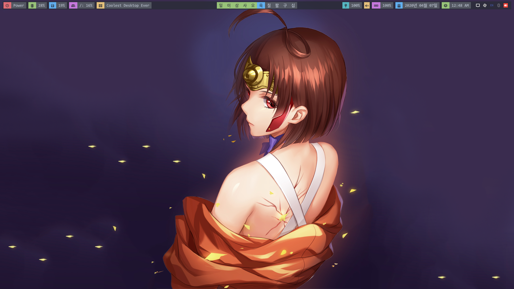
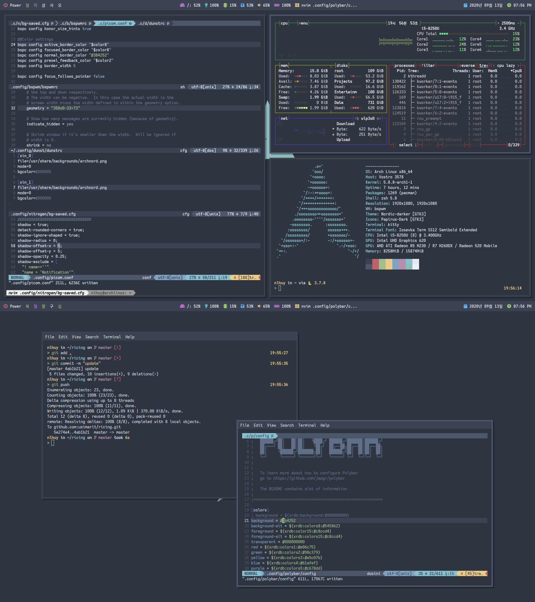

## Arch based linux ricing

Colorschemes are managed by `pywal`.

`dev.sh` to install all development environments.

`app.sh` to install all applications.

`setup.sh` links all config files to `$HOME/.config` and `$HOME`.

`darch.py` is the commandline interface for docker archlinux from `Dockerfile`.

### Screenshots

