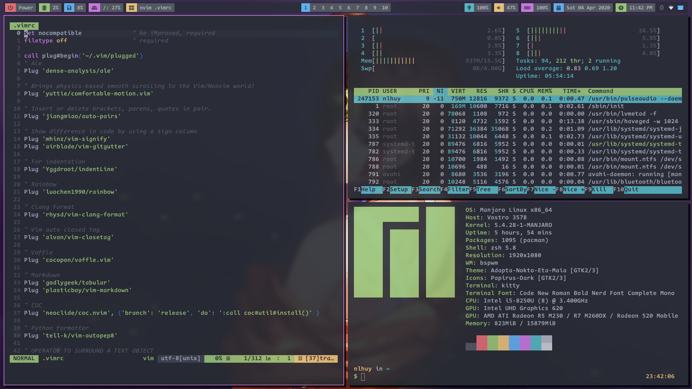

## Arch based linux ricing

Colorschemes are managed by `pywal`.

`install.sh` to install all applications and development environments.

`setup.sh` links all config files to `$HOME/.config` and `$HOME`.

### Screenshots

